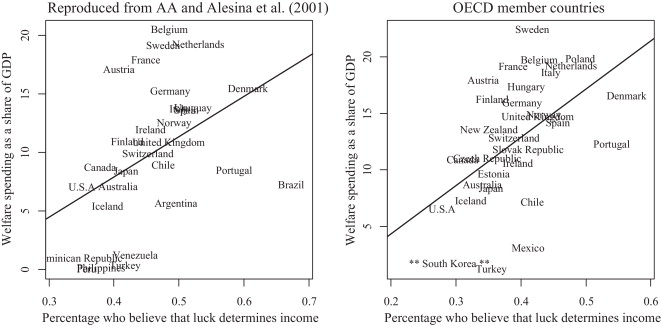
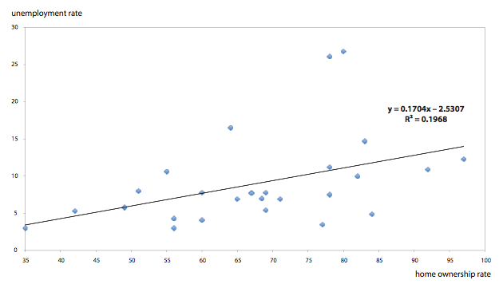

```{r, include=FALSE}
# Be sure to run these in your console as well:
library(mosaicData)

library(alr3)
library(car)
library(party)
library(lmtest)
library(MASS)
```

<!-- Place your answer to each question in the curly brackets
     For example:
     
     # Question 1 {a}
     # Question 2 {b}
     # Question 3 {c} 
     
     Submit your completed exam to the I-Learn dropbox:
       Final Exam: Final Attempt 
     for final grading.
     
     Note: you can submit the file twice before it is officially graded 
     and get feedback about how many questions are correct, if you want.
     
     Just use the "First Attempt" and "Second Attempt" dropboxes in 
     I-Learn. All questions must be answered to get feedback
     from these "First Attempt" and "Second Attempt" submissions. 
-->

## Question 1 {b}

Consider the linear model $Y_i = \beta_0 + \beta_1 X_{i1} + \beta_2 X_{i2} + \epsilon_i$. Which of the following is a true statement about this model?

(a) $\beta_0 + \beta_1 X_{i1} + \beta_2 X_{i2}$ describes the statistical relationship of the data to the true model.

(b) $\epsilon$ describes the statistical relationship between $Y$ and the predictor variables.

(c) The lack of an interaction term makes this model a purely functional relationship.

(d) The model is purely statistical and does not contain any functional relations.


## Question 2 {c}

Consider a linear regression model that will predict the body density of adult men using the predictors of: 

$X_1$: height (inches), 

$X_2$: ankle circumference (cm), 

$X_3$: wrist circumference (cm), and 

$X_4$: BMI. 

Which of the following would be the most statistically sound way to use regression to perform a hypothesis test to determine if the coefficient ($\beta_2$) for the ankle circumference (cm) is equal to the coefficient ($\beta_3$) for the wrist circumference (cm)?

(a) Use the general linear test with the full model as $E\{Y\} = \beta_0 + \beta_1 X_1 + \beta_2 X_2 + \beta_3 X_3 + \beta_4 X_4$ and the reduced model as $E\{Y\} = \beta_0 + \beta_1 X_1 + \beta_2 (X_2 + X_3) + \beta_4 X_4$.
	
(b) Compare the $t$ tests for $H_0: \beta_2 = 0$ and $H_0: \beta_3 = 0$. If both are significant or both are insignificant, then the coefficients are the same. If only one is significant while the other isn't, then the coefficients are different.
	
(c) Perform an extra sums of squares $F$ test to see if $X_2$ and $X_3$ can both be dropped from the model.
	
(d) Perform an independent samples $t$ test to determine if $H_0: \beta_2 = \beta_3$.


## Question 3 {c}

A study published in the Social Science Journal (September 2013, Pages 289–298) produced the following scatter plots of the predictor variable $X_1$ against two separate response variables $Y_1$ (left) and $Y_2$ (right). 

\



\

Which of the following statements is most appropriate for the plot on the RIGHT?

(a) Their linear regression provides very valuable information about how Welfare spending can be predicted by the percentage of people in the country who believe that luck determines income.
	
(b) U.S.A. and New Zealand are outliers that would need to be considered for their influence on the line before this regression would be valid.
	
(c) The constant variance of the errors and linearity of the relationship between $Y_2$ and $X_1$ are highly questionable.
	
(d) The $R^2$ value of this plot must only be about $0.08$.


## Question 4 {a}

One of the basic ideas of simple linear regression is that we assume that
	
(a) there is a probability distribution of the response variable $Y$ for each level of the predictor variable $X$.
	
(b) any variation in the response variable $Y$ can be described by changes in the explanatory variable $X$.
	
(c) the mean of the response variable $Y$ does not depend on the predictor variable $X$.
	
(d) the coefficient of the predictor variable $X$ does not differ dramatically from zero.


## Question 5 {b}

Which of the following is a FALSE statement concerning the regression model $Y_i = \beta_0 + \beta_1 X_i + \epsilon_i$?
	
(a) $\beta_0$ represents the average of the response variable $Y$ when $X = 0$.
	
(b) $\beta_1$ describes the change in the response variable $Y$ for every unit change in $X$.
	
(c) $\epsilon_i$ allows each observation $Y_i$ to land above or below the regression line.
	
(d) $X_i$ is considered to be fixed and measured without error.


## Question 6 {a}

Which of the following is a TRUE statement about least squares estimation of the regression parameters $\beta_0$ and $\beta_1$?
	
(a) The least squares estimates of $\beta_0$ and $\beta_1$ are chosen in such a way that the SSE is as small as it can possibly become.
	
(b) The smallest possible squared values of $\beta_0$ and $\beta_1$ are obtained from the least squares estimates.
	
(c) The regression line is moved around until the estimates of $\beta_0$ and $\beta_1$ are as small as they can possibly be.
	
(d) The regression line is adjusted so that the SSR is minimized for $\beta_0$ and $\beta_1$.


## Question 7 {d}

In the regression model $Y_i = \beta_0 + \beta_1 X_i + \epsilon_i$ we typically assume that the $\epsilon_i$ are normally distributed with a mean of zero and variance $\sigma^2$. What is the value of the MSE from the R output shown below?

```{r, echo=FALSE}
summary(lm(S ~ C, data=cloud))
```
	
(a) 0.9374
	
(b) 0.27466
	
(c) 0.02278
	
(d) 0.8787


## Question 8 {b}

Maximum likelihood estimation (MLE) is a powerful alternative to least squares estimation and requires only that the observations $Y_i$ are independent. Which of the following best describes the MLE approach to parameter estimation?
	
(a) MLE chooses the parameter values that minimize the likelihood function $L = \prod_{i=1}^n \frac{1}{(2 \pi \sigma^2)^{n/2}} \exp{ -\frac{1}{2 \sigma^2} (Y_i - \beta_0 - \beta_1 X_i)^2}$.
	
(b) MLE chooses the parameter values that are most consistent with the observed data.

(c) MLE chooses the parameter values that are specified in the null hypotheses.
	
(d) MLE chooses the parameter values that maximize the function $Q = \sum_{i=1}^n (\epsilon_i - \beta_0 - \beta_1 X_i)^2$.


## Question 9 {d}

In an article (Blanchflower, D.G., and Oswald, A.J. 2013. 'Does high home-ownership impair the labor market?' NBER working paper) concerning the effects of home ownership on the labor market, the authors made the concluding claim that "Home ownership is dangerous [to the labor market]." The following regression appeared as evidence in support of this claim. (Sadly the best they could seem to come up with was a plot from Excel!) 



What is most concerning about this regression and what advice do you have?

(a) The linear assumption does not appear to be satisfied due to the trend in the data. Try a transformation on the predictor variable to improve the fit.
	
(b) The $R^2$ value is incredibly low ($R^2 = 0.1968$) so the regression is meaningless. Try using logistic regression instead to see if the fit can be improved.
	
(c) The constant variance assumption appears to be violated. Try using a transformation on $X$.
	
(d) There are two important outliers in the top-right of the plot. Try using Robust Regression to minimize the effect of these outliers and hopefully improve the fit of the model.


## Question 10 {b}

Which of the following provides the correct form and distribution of the test statistic for testing $H_0: \beta_1 = 5.2$ against the alternative that $H_a: \beta_1 < 5.2$ in the regression model 

$$
  Y_i = \beta_0 + \beta_1 X_{i1} + \beta_2 X_{i2} + \epsilon_i
$$

where $\epsilon_i \sim N(0,\sigma^2)$.

(a) $t = \frac{b_1 - \beta_1}{s\{b_1\}}$ where $t \sim t(n-2)$
	
(b) $t = \frac{b_1 - \beta_1}{s\{b_1\}}$ where $t \sim t(n-3)$
	
(c) $F = \frac{MSR}{MSE}$ where $F \sim F(1, n-2)$
	
(d) $F = \frac{MSR}{MSE}$ where $F \sim F(2, n-3)$


## Question 11 {d}

Which of the following is the correct value of the test statistic and $p$-value for testing the hypothesis that 

$$H_0: \beta_2 = \beta_3 = 0$$ 
$$H_a: \text{at least one differs from zero}$$

in the regression model 

$$Y_i = \beta_0 + \beta_1 X_{i1} + \beta_2 X_{i2} + \beta_3 X_{i3} + \epsilon_i$$ 

based on the following data?

```{r, echo=FALSE}
q11 <- data.frame(Y = c(530.8689, 683.7729, 620.2749, 629.9598, 597.7565, 651.6689, 692.9957, 651.6329, 592.0616, 588.2080, 541.2540, 530.9478, 589.9968, 547.7664, 589.7463, 666.9314, 563.8086, 677.2037, 426.4581, 569.9743, 629.4311, 683.8226, 557.7469, 612.1058, 523.6173, 601.5595, 612.9020, 646.7708, 612.0775, 577.6961), X1 = c(4.617738, 7.646772, 5.673236, 7.041082, 4.644143, 4.314055, 6.899508, 5.580610, 3.980101, 4.612346, 4.308008, 1.250665, 3.257133, 10.404529, 9.709169, 5.886382, 2.520218, 10.465929, 6.075720, 6.248463, 4.338076, 7.250860, 3.980734, 4.945536, 1.749287, 3.480814, 8.925894, 4.596916, 4.082956, 4.878918), X2 = c(80.96922, 66.79564, 88.23718, 75.77264, 80.34203, 84.28017, 68.62289, 81.75153, 84.33902, 75.78548, 76.14887, 83.15825, 88.85439, 76.15539, 85.46673, 74.75758, 82.34910, 75.75019, 93.54639, 94.17053, 77.24127, 87.72626, 79.37617, 83.66597, 97.85477, 85.05501, 82.77558, 82.65230, 70.26752, 79.89521), X3 = c(135.1429, 174.3327, 159.8953, 158.8643, 153.0478, 167.2850, 177.3306, 166.7834, 152.0271, 150.0427, 137.1977, 137.5809, 152.1103, 136.5697, 148.8229, 170.3947, 145.7163, 170.5522, 107.5339, 144.6890, 160.9916, 173.7115, 142.3195, 156.8516, 135.3610, 154.9164, 152.6809, 165.0345, 156.9854, 147.6628))

anova(lm(lm(Y~X1,q11)),lm(Y ~ X1 + X2 + X3, q11))
```

```{r}
head(q11)
dim(q11)
```


(a) $F = 97.226$ and $p = 2.18e-16$
	
(b) $F = 1222.075$ and $p = 1.094e-25$
	
(c) $F = 409.280$ and $p = 6.96e-31$
	
(d) $F = 6808.1$ and $p = 4.37657e-36$


## Question 12 {c}

Run the following commands in R: 

`plot(uptake ~ conc, data=CO2, pch=16)`

`library("alr3")`

`pureErrorAnova(lm(uptake ~ conc, data=CO2))`

```{r}
plot(uptake ~ conc, data=CO2, pch=16)
library("alr3")
pureErrorAnova(lm(uptake ~ conc, data=CO2))
```


What conclusions can you draw from the output of the above R code?
	
(a) The constant variance assumption is clearly not satisfied for this data.
	
(b) Even though the scatter plot doesn't look the best, there is no evidence that the assumptions are not satisfied.
	
(c) The linear relation assumption is clearly not satisfied for this data.
	
(d) A linear regression is appropriate and the "conc" variable is a significant predictor of "uptake".


## Question 13 {b}

Run the following commands in R:

`plot(demand ~ Time, data=BOD, pch=16)`

`cooks.distance(lm(demand ~ Time, data=BOD))`

```{r}
plot(demand ~ Time, data=BOD, pch=16)
cooks.distance(lm(demand ~ Time, data=BOD))
```


Using the output from the above code, which of the following statements is most correct?
	
(a) Case #3 can be considered to be an outlier.
	
(b) If Case #3 is considered to be an outlier, then so should Case #1.
	
(c) Case #3 and Case #4 should probably be removed from the regression.
	
(d) If Case #4 is removed, then the regression will be more appropriate.


## Question 14 {a}

A researcher was hoping to develop a regression model that relates a Loblolly Pine tree height to its age. They began creating their model with the following commands in R. Run these commands one at a time in R to follow the researcher's thought process:

```{r, eval=FALSE}
library(car)
plot(height ~ age, data=Loblolly)
plot(lm(height ~ age, data=Loblolly), which=1)
plot(lm(height ~ sqrt(age), data=Loblolly), which=1)
boxCox(lm(height ~ age, data=Loblolly))
plot(lm(height^(5/4) ~ age, data=Loblolly), which=1)
plot(lm(height ~ (age>5) + sqrt(age)*(age>5), data=Loblolly), which=1)
```

At this point, the researcher decided to perform a weighted regression and came up with the following model summary. 

```{r, echo=FALSE}
absres <- abs(lm(height ~ (age>5) + sqrt(age)*(age>5), data=Loblolly)$res)
w <- lm(absres ~ (age>5) + sqrt(age)*(age>5), data=Loblolly)$fitted
summary(lm(height ~ (age>5) + sqrt(age)*(age>5), data=Loblolly, weights=1/w))
plot(height ~ age, data=Loblolly)
curve(-16.268+11.839*sqrt(x), add=TRUE, from=0, to=5)
```

Which of the following is the correct model description for Loblolly Pine trees that are older than 5 years? (In other words, what equation is needed to add the rest of the regression function to the plot above?)
	
(a) $\hat{Y} = -29.1905 + 17.962\sqrt{\text{age}}$
	
(b) $\hat{Y} = -16.2682 -13.1179\cdot \text{age} + 11.8392\sqrt{\text{age}}$
	
(c) $\hat{Y} = -16.2682 -13.1179\cdot \text{age} + 11.8392\cdot \text{age}\sqrt{\text{age}}$
	
(d) $\hat{Y} = -16.2682 -13.1179\cdot \text{age} + 11.8392\sqrt{\text{age}} + 6.1713\text{age}\sqrt{\text{age}}$


## Question 15 {c}

A simple linear regression is performed using the model $Y_i = \beta_0 + \beta_1 X_i + \epsilon_i$. The residuals are plotted below against some omitted predictor variables, $X_2$ and $X_3$. What conclusions can you draw from the following plots?

```{r, echo=FALSE}
q11.lm <- lm(Y ~ X1, data=q11)
par(mfrow=c(1,2))
plot(q11.lm$res ~ X2, data=q11)
plot(q11.lm$res ~ X3, data=q11)
```

(a) That $X_2$ should be included in the regression analysis.
	
(b) That $X_2$ needs to be transformed in some way.
	
(c) That $X_3$ should be included in the regression analysis.
	
(d) That $X_3$ does not need to be transformed because it is already linear.


## Question 16 {a}

A linear regression is performed and the following residuals are obtained: -1.9428571, -1.6642857, 5.3142857, 0.5928571, -1.5285714, -0.7714286. 

```{r}
resid <- c(-1.9428571, -1.6642857, 5.3142857, 0.5928571, -1.5285714, -0.7714286)

1-sum(resid^2)/107.2133

```


Also, it turns out that 

$$\sum_{i=1}^6(Y_i - \bar{Y_i})^2 = 107.2133$$ 

What is the value of $R^2$ for these data?

(a) $R^2 = 0.6449$
	
(b) $R^2 = 0.5243$
	
(c) $R^2 = 0.3356$
	
(d) $R^2 = 0.7214$


## Question 17 {b}

A regression model was developed to model the number of Assaults occurring in a U.S. state using a measurement of the Urban Popluation of the state as the explanatory variable. The residual plot from this analysis is shown below.:

```{r, echo=FALSE}
plot(lm(Assault ~ UrbanPop, data=USArrests), which=1)
```

About how many assaults occurred in North Carolina?

(a) 200
	
(b) 340
	
(c) 140
	
(d) 60


## Question 18 {b}

Consider the following scatterplot:

```{r}
plot(height ~ age, data=Loblolly)
```

What conclusions can we draw from a regression on the data shown in the scatterplot above?

(a) There do not appear to be any serious problems with the regression assumptions for these data.
	
(b) It is hard to know which other regression assumptions are being violated because the linearity assumption clearly does not hold for these data.
	
(c) Other than the extreme outliers in the plot, all the other regression assumptions look like they hold for these data.
	
(d) Constant variance may be of concern for these data, but otherwise, it looks like a really good scenario for a linear regression.


## Question 19 {d}

Run the following code in R:

```{r, eval=FALSE}
us.lm <- lm(Assault ~ UrbanPop + Murder + Rape, data=USArrests)
par(mfrow=c(1,2))
plot(us.lm, which=1)
plot(us.lm, which=4)
```

Of the possible outlying points of North Carolina, Deleware, and Hawaii, which should potentially be removed from the regression because of their extraordinary pull on the regression line?

(a) All of them could be removed. They are all dramatically effecting the regression.
	
(b) North Carolina and Deleware could be removed, but Hawaii does not actually seem to have undue influence on the regression.
	
(c) North Carolina and Hawaii could be removed, but Deleware does not seem to be having much of an impact on the regression.
	
(d) North Carolina could be removed, but surprisingly Deleware and Hawaii have less influence on the regression than do Georgia and Rhode Island.


## Question 20 {b}

A simple linear regression is performed for a data set with 14 observations. A Q-Q Plot of the resulting residuals is created with a correlation of 0.939. What conclusions can you make about the model assumptions from this information using the alpha=0.05 level of significance?

(a) The residuals can be considered to be normal.
	
(b) The residuals should not be considered to be normal.
	
(c) The test is inconclusive because there are too few observations.
	
(d) The residuals are probably right skewed.


## Question 21 {a}

Run the following code in R (and any other useful commands).

```{r, eval=FALSE}
Lob.lm <- lm(height ~ (age>5) + sqrt(age)*(age>5), data=Loblolly)
lmtest::bptest(Lob.lm)
```

Perform an official test to decide if there is evidence that the constant variance assumption is being violated. 

(a) Yes, there is evidence that the constant variance assumption is not satisfied (p = 0.0009725)
	
(b) Yes, there is evidence that the constant variance assumption is not satisfied (p = 0.004288)
	
(c) No, the constant variance assumption does not appear to be violated (p = 0.084288)
	
(d) No, the constant variance assumption does not appear to be violated (p = 0.092320)


## Question 22 {a}

Consider the regression of "dist ~ speed" that is shown in the output table below. Estimate the distance it would take a 1920's vehicle to come to a complete stop when traveling at a speed of 25 mph using 99% confidence.

```{r}
cars.lm <- lm(dist ~ speed, data=cars)
summary(cars.lm)
predict(cars.lm, tibble::tibble(speed = 25), interval = "prediction")
```

(a) Between 48.5 feet and 113.0 feet.
	
(b) Between 71.6 feet and 89.9 feet.
	
(c) Between 80.1 feet and 81.2 feet.
	
(d) Between 37.7 feet and 123.7 feet.


## Question 23 {a}

Which regression model gives the highest adjusted $R^2$ for the following scatterplot?

```{r}
plot(HT18 ~ HT2, data=BGSboys, xlab="2-Year Old Height", ylab="18-Year Old Height")
```

(a) A simple linear regression of the 18-year old height on the 2-year old height.
	
(b) A second order polynomial regression model of the 18-year old height on the 2-year old height.
	
(c) A third order polynimial regression model of the 18-year old height on the 2-year old height.
	
(d) A fourth order polynomial regression of the 18-year old height on the 2-year old height.


## Question 24 {b}

Consider the data shown in the colored scatterplot below.

```{r}
palette(c("skyblue","firebrick"))
BGS <- rbind(BGSboys,BGSgirls)
plot(HT18 ~ HT2, data=BGS, col=as.factor(Sex), pch=Sex+5,
     xlab="2-Year Old Height", ylab="18-Year Old Height")
legend("topleft", legend=c("Boys","Girls"), pch=c(5,6), col=palette(), bty='n')
```

Which of the following regression models gives the best fit of this data?

(a) A regression of 18-year old height on 2-year old height with a dummy variable for gender.
	
(b) A regression of 18-year old height on 2-year old height with a dummy variable for gender and an interaction term with gender and 2-year old height.
	
(c) A regresion of 18-year old height on 2-year old height.
	
(d) A regression of 18-year old height on the interaction of 2-year old height and gender.


## Question 25 {c}

A researcher collected data on four independent variables ($X_1$, $X_2$, $X_3$, and $X_4$) and one dependent variable ($Y$). They would like to apply the general linear F test to test the following hypotheses:

$H_0: E\{Y\} = \beta_0 + \beta_1 X_1 + \beta_4 X_4$
$H_a: E\{Y\} = \beta_0 + \beta_1 X_1 + \beta_2 X_2 + \beta_3 X_3$

Which of the following would be the best advice to the researcher?

(a) Instead of testing these hypotheses with a general linear F test (which actually isn't possible because they aren't nested models) the researcher could compare the AIC (or some other) criterion for each model to decide which one fit the data the best.
	
(b) These hypotheses can only be tested if there are repeated values of the joint predictor variables. If there aren't any repeated values, then using an extra sums of squares F test would be the next best approach.
	
(c) These hypotheses are equivalent to using an extra sums of squares F test where the null hypothesis is that $H_0: \beta_4 = \beta_2 + \beta_3$. Since the extra sums of squares F test is easier to perform and easier to interpret, this would be the preferred approach.
	
(d) The researcher should perform the general linear F test as specified. They should just be sure to verify that each model meets the regression assumptions before performing the test or the results of the test will be invalid.
