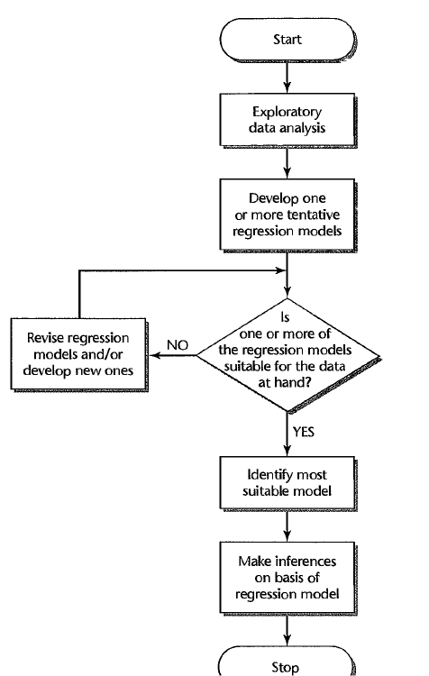
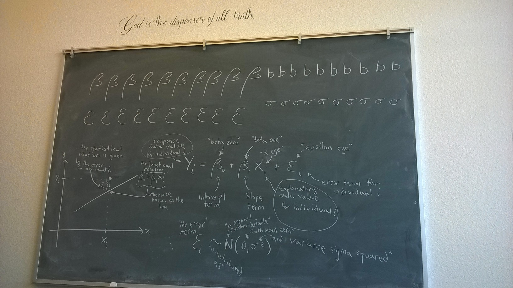
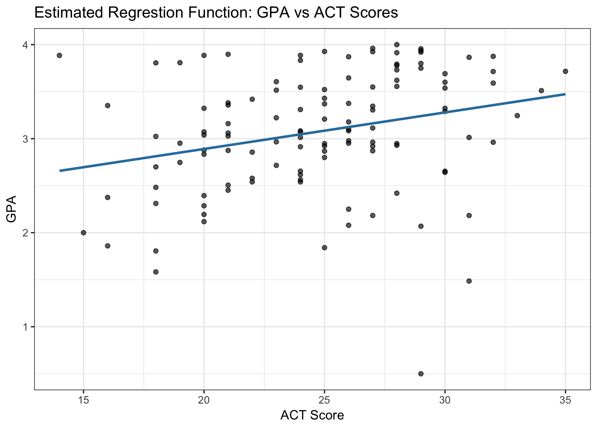
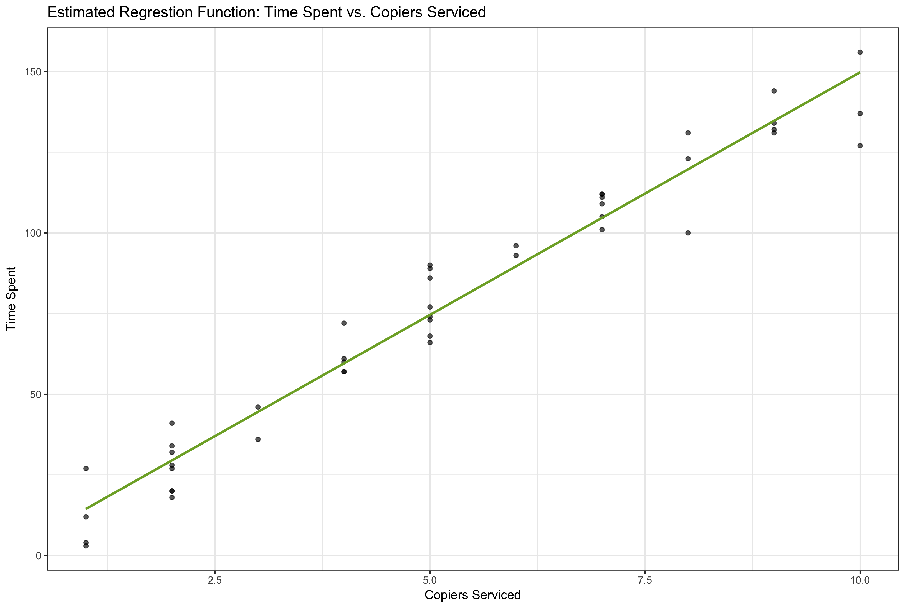
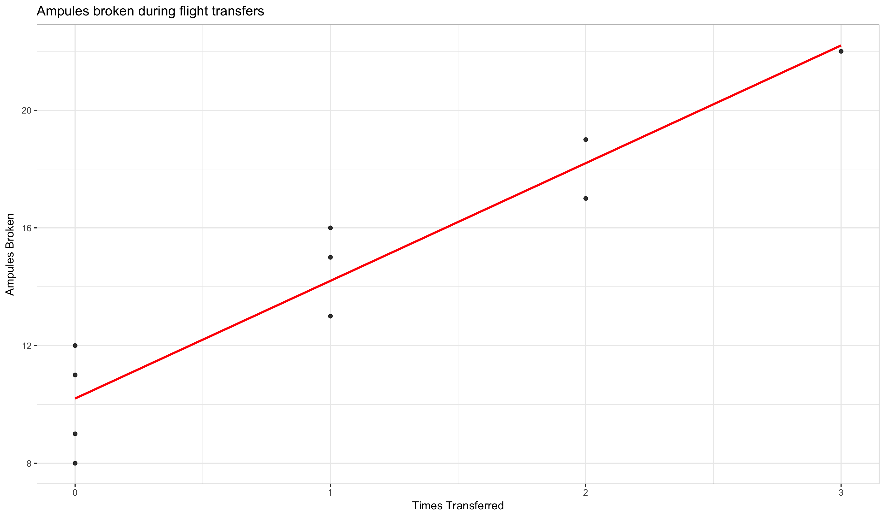
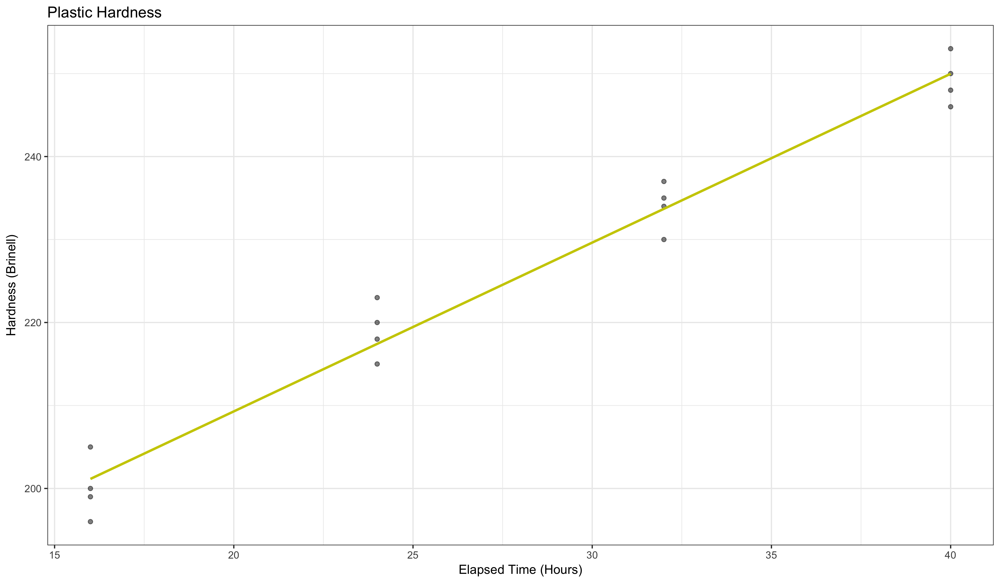

```{r, include=FALSE}
library(tidyverse)
library(broom)
library(default)
library(editheme)
pal <- get_pal(theme = "Tomorrow Night")
```


## Instructions

1. Study Sections 1-5 of Chapter 1 -- "Linear Regression with One Predictor Variable."    
<span id=note>(You may also choose to study Sections 6-8 if you are interested in the theory behind regression.)</span>

2. Attempt and submit at least <span id=recpoints style="padding-left:0px;">{24}</span> Hard Work Points by Saturday at 11:59 PM.    
<span id=note>Over <span id=points style="padding-left:0px;">{30}</span> gets you {+1} Final Exam Point.</span>    
<span id=note>Over <span id=points style="padding-left:0px;">{40}</span> gets you {+2} Final Exam Points.</span>    
<span id=note>Over <span id=points style="padding-left:0px;">{50}</span> gets you {+3} Final Exam Points.</span>

<span id=recpoints>{...}</span> are "Recommended" and will earn you the minimum points required. 

<span id=points>{...}</span> are optional, but the more of these you complete, the better.

The format of reporting your score on each problem is: 

**\{ Earned Points / Attempted Points \}**

* **Attempted Points**: You gave the problem your time and energy, but aren't sure if you are completing the problem correctly or not. 
* **Earned Points**: You are confident you have completed the problem correctly by comparing your work to the [Student Solutions](https://byui.brightspace.com/d2l/common/dialogs/quickLink/quickLink.d2l?ou=358268&type=content&rcode=byui_production-1198908), other students in class, or the examples in the book. This should always be less than or equal to **Attempted Points**.

<br/>

## Reading Points <span id=headpoints>{21} Possible</span>

### Section 1.1 <span id=recpoints>{3}</span><span id=report>{ 3 / 3 }</span>

**Summary:** When looking at the relationship between two variables we can pretty much categorize the relationship into **two** different categories, _functional_ and _statistical_. 

A functional relationship can be described by one independent variable $X$ and one dependent variable $Y$ where $Y$ can be expressed as a function of $X$ such as: $Y = f(X)$. The idea is that the functional relationship is _perfect_ in that all observation, when plotted, will follow a direct line with no deviation. 

A statistical relationship indicates that there is not a perfect relationship between the two variables. These observations may follow a trend but will not fall exactly on the curve of the relationship. 

A scatter plot can be an important tool when determining the type of relationship between your variables. 

### Section 1.2 <span id=recpoints>{3}</span><span id=report>{ 3 / 3 }</span>

**Summary:** Important history side note. Sir Francis Galton when studying the relationship between heights of parents and children saw that both groups tended to "revert" or "regress" towards the mean of the group. He called this a "regression to mediocrity". This was the beginnings of today's regression models. 

There are two "essential ingredients" to statistical regression. 

  1. The response variable Y typically moves with the predictor variable X in a systematic fashion.
  2. The multiple points around the curve of a statistical relationship
    
There can be many types of regressions (linear, curvilinear) but they will always have _regression function_ and a _regression curve_. It is also important to note that the two ingredients are embedded in a regression model by assuming that:

  * There is a probability distribution of Y for each level of X [^1]
  * The means of these probability distributions vary in some systematic fashion with X. [^1] 

[^1]: Kutner, M. H., Nachtsheim, C., Neter, J., & Li, W. (2005). Applied linear statistical models.

There can more than one predictor variable. Multiple predictor variables create a regression surface in which we can determine the relationship between the means of the probability distributions of all predictor variables. When choosing predictor variables it's important to keep in mind the effects it will have on your model. Many times the goal is to reduce the variation in $Y$ and other times you will choose variables based on their importance to the question you are asking and its casual relationship to $Y$. We will go over this more in **Chapter 9**

Often times the functional form of a regression model is not known but there can by underlying theory that might help when doing specific models. Sometimes using the linear model is a good approximation to the true underlying functional regression. 

Regression analysis serves three major purposes:

  1. Description
  2. Control
  3. Prediction
  
Regressions cannot imply causation just because of the relationship between variables. "No Matter How Strong a statistical relation between $X$ and $Y$, no cause-and-effect pattern is necessarily implied..." [^1]

### Section 1.3 <span id=recpoints>{3}</span><span id=report>{ 3 / 3 }</span>

**Summary:** 

__Formal Model:__ $Y_{i} + \beta_{0} + \beta_{1}X_{i} + \varepsilon_{i}$

Since $E[\varepsilon_{i}] = 0$, it follows that:

\[
E[Y_{i}] = E[\beta_{0} + \beta_{1}X_{i} + \varepsilon_{i}] = \beta_{0} + \beta_{1}X_{i} + E[\varepsilon_{i}] = \beta_{0} + \beta_{1}X_{i}  
\]

__Regression Model:__ $E[Y] = \hat{Y}_{i} = b_{0} + b_{1}X_{i}$

### Section 1.4 <span id=recpoints>{2}</span><span id=report>{ 2 / 2 }</span>

**Summary:**

__Observational Data:__

Observational data is often harder to use with controlled experiments because there are many variables that cannot be controlled that effect other variables. This makes it harder to provide adequate information about cause-and-effect relationships. 

__Experimental Data:__

Experimental Data is a lot easier to control for outside factors. It is then easier to imply a cause-and-effect relationship by randomly assigning treatments to the sample you are testing. The random application of treatment tends to equalize any outside variables that influences the units. 

__Completely Randomized Design:__

The most basic type of statistical design for making randomized assignments of treatments to experimental units. 

### Section 1.5 <span id=recpoints>{2}</span><span id=report>{ 2 / 2 }</span>

**Summary:**


  

### Section 1.6 <span id=points>{3}</span><span id=report>{ / }</span>


### Section 1.7 <span id=points>{2}</span><span id=report>{ / }</span>


### Section 1.8 <span id=points>{3}</span><span id=report>{ / }</span>


<br/>

## Theory Points <span id=headpoints>{11} Possible</span>


### Problem 1 <span id=recpoints>{3}</span><span id=report>{ 3 / 3 }</span>

Recreate this chalkboard in your own handwriting 
 

<!-- Uncomment the code below, and insert your own picture file path to load the picture of your version of this chalkboard.-->

__Solution:__

 

### Problems 1.29 and 1.30 <span id=points>{2}</span><span id=report>{ / }</span>
 
### Problem 1.32 <span id=points>{2}</span><span id=report>{ / }</span>
 
### Problem 1.33 <span id=points>{4}</span><span id=report>{ / }</span>
 
### Problem 1.34 <span id=points>{3}</span><span id=report>{ / }</span>


<br/> 

## Application Points <span id=headpoints>{19} Possible</span>


<a id=datalink target="_blank" href=http://www.stat.ufl.edu/~rrandles/sta4210/Rclassnotes/data/textdatasets/index.html>Download Data Files</a>


### Problem 1.19 <span id=recpoints>{4}</span><span id=report>{ 4 / 4 }</span>

```{r getp19, fig.show='hide'}
# Load the Problem 1.19 Data into the object "p1.19":
p1.19 <- read.table("http://www.stat.ufl.edu/~rrandles/sta4210/Rclassnotes/data/textdatasets/KutnerData/Chapter%20%201%20Data%20Sets/CH01PR19.txt")

# Rewrite the column names to be "Y" and "X" to match the textbook:
colnames(p1.19) <- c("Y","X")

p19.lm <- lm(Y ~ X, data = p1.19)

pred30 <- predict(p19.lm, tibble(X = 30))

ggplot(p1.19, aes(X, Y)) +
  geom_point(color = col_fg(pal, fade = 0.2), alpha = .5) +
  geom_smooth(method = "lm", col = "#317eac", se = FALSE) + 
  labs(title = "Estimated Regrestion Function: GPA vs ACT Scores", 
       y = "GPA", x = "ACT Score") + 
  theme_editor("Tomorrow Night")
```

**Grade point average.** The director of admissions of a small college selected 120 students at random from the new freshman class in a study to determine whether a student's grade point average (GPA) at the end of the freshman year (Y) can be predicted from the ACT test score (X). The results of the study follow. Assume that the first-order regression model (1.1) is appropriate.

  __a)__ Obtain the least squares estimates $\beta_{0}$ and $\beta_{1}$, and state the estimated regression function.
  
  __Solution:__
  <div id="rcorners2">
  $\hat Y_{i} = `r round(tidy(p19.lm)[1,2], 4)` + `r round(tidy(p19.lm)[2,2], 4)`x_{i}$
  
  $\text{Where } e \sim N(0,\hat\sigma^{2}) \text{ Where } \hat\sigma^{2} = `r round(glance(p19.lm)[,"sigma"], 4)`^{2}$
  </div></br>
  
  __b)__ Plot the estimated regression function and the data. Does the estimated regression function appear to fit the data well?
  
  __Solution:__
  <div id="rcorners2">
  
  </div></br>
  
  __c)__ Obtain a point estimate of the mean freshman GPA for students with ACT test score $X = 30$.
  
  __Solution:__
  <div id="rcorners2">
  $\hat Y_{i} = `r round(tidy(p19.lm)[1,2], 4)` + `r round(tidy(p19.lm)[2,2], 4)`(30) = `r pred30`$
  </div></br>
  
  __d)__ What is the point estimate of the change in the mean response when the entrance test score increases by one point?
  
  __Solution:__
  <div id="rcorners2">
  Given in one unit increase in entrance test score a student's GPA will increase 0.0388, on average. 
  </div></br>

### Problem 1.20 <span id=recpoints>{4}</span><span id=report>{ 4 / 4 }</span> 

```{r getp20, fig.show='hide'}
# Load the Data:
p1.20 <- read.table("http://www.stat.ufl.edu/~rrandles/sta4210/Rclassnotes/data/textdatasets/KutnerData/Chapter%20%201%20Data%20Sets/CH01PR20.txt")

# Rewrite the column names to be "Y" and "X" to match the textbook:
colnames(p1.20) <- c("Y","X")

p20.lm <- lm(Y ~ X, p1.20)

pred5 <- predict(p20.lm, tibble(X = 5))

ggplot(p1.20, aes(X, Y)) +
  geom_point(alpha = .65) +
  geom_smooth(method = "lm", col = "#7eac31", se = FALSE) + 
  labs(title = "Estimated Regrestion Function: Time Spent vs. Copiers Serviced", 
       y = "Time Spent", x = "Copiers Serviced") + 
  theme_bw()
```

**Copier maintenance.** The Tri-City Office Equipment Corporation sells an imported copier on a franchise basis and performs preventive maintenance and repair service on this copier. The data below have been collected from 45 recent calls on users to perform routine preventive maintenance service; for each call, X is the number of copiers serviced and Y is the total number of minutes spent by the service person. Assume that first-order regression model (1.1) is appropriate.

  __a)__ Obtain the estimated regression function.
  
  __Solution:__
  $\hat Y_{i} = `r round(tidy(p20.lm)[1,2], 4)` + `r round(tidy(p20.lm)[2,2], 4)`x_{i}$
  
  $\text{Where } e \sim N(0,\hat\sigma^{2}) \text{ Where } \hat\sigma^{2} = `r round(glance(p20.lm)[,"sigma"], 4)`^{2}$
  
  __b)__ Plot the estimated regression function and the data how well does the estimated regression function fit the data?
  
  __Solution:__
  
  
  __c)__ Interpret $b_{0}$ in your estimated regression function. Does $b_{0}$ provide any relevant information here? Explain.
  
  __Solution:__ No $b_{0}$ does not offer any relevant information because it is not possible to service negative copiers or spend negative time, so it is not useful. 
  
  __d)__ Obtain a point estimate of the mean service time when $X = 5$ copiers are serviced.
  
  __Solution:__ $\hat Y_{i} = `r round(tidy(p20.lm)[1,2], 4)` + `r round(tidy(p20.lm)[2,2], 4)`(5) = `r pred5`$


### Problem 1.21 <span id=points>{4}</span><span id=report>{ 4 / 4 }</span> 

```{r getp21, fig.show='hide'}
# Load the Data:
p1.21 <- read.table("http://www.stat.ufl.edu/~rrandles/sta4210/Rclassnotes/data/textdatasets/KutnerData/Chapter%20%201%20Data%20Sets/CH01PR21.txt")

# Rewrite the column names to be "Y" and "X" to match the textbook:
colnames(p1.21) <- c("Y","X")

p21.lm <- lm(Y ~ X, p1.21)

pred1 <- predict(p21.lm, tibble(X = 1))

pred2 <- predict(p21.lm, tibble(X=2))

ggplot(p1.21, aes(X, Y)) + 
  geom_point(alpha = .8) + 
  geom_smooth(method = lm, se = FALSE, col = "red") + 
  labs(title = "Ampules broken during flight transfers", 
       x = "Times Transferred", 
       y = "Ampules Broken") +
  theme_bw()
```

__Airfreight breakage:.__ A substance use in biological and medical research is shipped by airfreight to users in cartons of 1000 ampules. The data below, involving 10 shipments, were collected on the number of times the carton was transferred from one aircraft to another over the shipment route (X) and the number of ampules found to be broken upon arrival (Y). Assume the first-order regression model (1.1) is appropriate. 

__a:__ Obtain the estimated regression function. Plot the estimated regression function and the data. Does a linear regression function appear to give a good fit here?

  __Solution:__
  
  $\hat Y_{i} = `r round(tidy(p21.lm)[1,2], 4)` + `r round(tidy(p21.lm)[2,2], 4)`x_{i}$ - The amount of data is worrying, I would think that if we were able to collect more data we'd have a better fit model but given the trend it looks like it would be a good fit. 
  
  

__b:__ Obtain a point estimate of the expected number of broken ampules when X = 1 transfer is made.  

  __Solution:__ $\hat Y_{i} = `r round(tidy(p21.lm)[1,2], 4)` + `r round(tidy(p21.lm)[2,2], 4)`(1) = `r pred1`$

__c:__ Estimate the increase in expected number of ampules broken when there are 2 transfers as compared to 1 transfer.

  __Solution:__ `r pred2 - pred1`

__d:__ Verify that your fitted regression line goes through the point $\bar X, \bar Y)$.

  __Solution:__ (`r mean(p1.21$X)`,`r mean(p1.21$Y)`) - TRUE

### Problem 1.22 <span id=points>{3}</span><span id=report>{ 3 / 3 }</span> 

```{r getp22, fig.show='hide'}
# Load the Data:
p1.22 <- read.table("http://www.stat.ufl.edu/~rrandles/sta4210/Rclassnotes/data/textdatasets/KutnerData/Chapter%20%201%20Data%20Sets/CH01PR22.txt")

# Rewrite the column names to be "Y" and "X" to match the textbook:
colnames(p1.22) <- c("Y","X")

p22.lm <- lm(Y ~ X, p1.22)

pred40 <- predict(p22.lm, tibble(X = 40))

ggplot(p1.22, aes(X, Y)) +
  geom_point(alpha = 0.5) + 
  geom_smooth(method = lm, se = FALSE, col = "#cccc00") + 
  labs(title = "Plastic Hardness", 
       x = "Elapsed Time (Hours)",
       y = "Hardness (Brinell)") + 
  theme_bw()
```

__Plastic Hardness.__ Refer to Problems 1.3 and 1.14. Sixteen batches of the plastic were made and from each batch one test item was molded. Each test item was randomly assigned to one of the four predetermined time levels, and the hardness was measures after the assigned elapsed time. X is the elapsed time in hours and Y is hardness in Brinell units. Assume that first-order regression model (1.1) is appropriate. 

__a:__ Obtain the estimated regression function. Plot the estimated regression function and the data. Does a linear function appear to give a good fit here?

  __Solution:__
  
  $\hat Y_{i} = `r round(tidy(p22.lm)[1,2], 4)` + `r round(tidy(p22.lm)[2,2], 4)`x_{i}$ 
  
  

__b:__ Obtain a point estimate of the mean hardness when X = 40 hours. 

  __Solution:__ $\hat Y_{i} = `r round(tidy(p22.lm)[1,2], 4)` + `r round(tidy(p22.lm)[2,2], 4)`(40) = `r pred40`$

__c:__ Obtain a point estimate of the change in mean harness when X increases by 1 hour. 

  __Solution:__ $b_{1} = `r round(tidy(p22.lm)[2,2], 4)`$

### Problem 1.27 <span id=points>{2}</span><span id=report>{ / }</span>

```{r getp27}
# Load the Data:
p1.27 <- read.table("http://www.stat.ufl.edu/~rrandles/sta4210/Rclassnotes/data/textdatasets/KutnerData/Chapter%20%201%20Data%20Sets/CH01PR27.txt")

# Rewrite the column names to be "Y" and "X" to match the textbook:
colnames(p1.27) <- c("Y","X")
```


### Problem 1.28 <span id=points>{2}</span><span id=report>{ / }</span>

```{r getp28}
# Load the Data:
p1.28 <- read.table("http://www.stat.ufl.edu/~rrandles/sta4210/Rclassnotes/data/textdatasets/KutnerData/Chapter%20%201%20Data%20Sets/CH01PR28.txt")

# Rewrite the column names to be "Y" and "X" to match the textbook:
colnames(p1.28) <- c("Y","X")
```


 


<style>
#points {
  font-size:1em;
  padding-left:15px;
  font-weight:bold; 
  color:#317eac;
}

#recpoints {
  font-size:1em;
  padding-left:15px;
  font-weight:bold; 
  color:#7eac31;
}

#report {
  font-size:.7em;
  padding-left:15px;
  font-weight:normal; 
  color:#5a5a5a;
}

#datalink {
  font-size:.8em;
  color:#317eac;
  padding-left:5px;
}

#note {
  font-size:.8em;
  color:#787878;
}

#headpoints {
 font-size:12pt;
 color: #585858; 
 padding-left: 15px;
}
</style>
 

 

 