## Instructions

1. Study Sections 3.1-3.8 of Chapter 3: "Diagnostics and Remedial Measures."    
<span id=note>(We will study more of Chapter 3 next week.)</span>

2. Attempt and submit at least <span id=points style="padding-left:0px;">{52}</span> Hard Work Points by Saturday at 11:59 PM.    
<span id=note>Over <span id=points style="padding-left:0px;">{56}</span> gets you {+1} Final Exam Point.</span>    
<span id=note>Over <span id=points style="padding-left:0px;">{62}</span> gets you {+2} Final Exam Points.</span>    
<span id=note>Over <span id=points style="padding-left:0px;">{70}</span> gets you {+3} Final Exam Points.</span>

## Reading Points <span id=headpoints>{30} Possible</span>

<div style="padding-left:20px;">

### Section 3.1 <span id=recpoints>{2}</span><span id=report>{ 2 / 2 }</span>

### Section 3.2 <span id=recpoints>{2}</span><span id=report>{ 2 / 2 }</span>

### Section 3.3 <span id=recpoints>{8}</span><span id=report>{ 8 / 8 }</span>

### Section 3.4 <span id=recpoints>{2}</span><span id=report>{ 2 / 2 }</span>

### Section 3.5 <span id=recpoints>{2}</span><span id=report>{ 2 / 2 }</span>

### Section 3.6 <span id=recpoints>{6}</span><span id=report>{ 6 / 6 }</span>

### Section 3.7 <span id=recpoints>{7}</span><span id=report>{ 7 / 7 }</span>

### Section 3.8 <span id=recpoints>{1}</span><span id=report>{ 1 / 1 }</span>

</div>

## Theory Points <span id=headpoints>{9} Possible</span>

<div style="padding-left:20px;">

### 3.1 <span id=recpoints>{2}</span><span id=report>{ 2 / 2 }</span>

Distinguish between (1) residual and semistudentized residual, (2) $E[\varepsilon_{i}] = 0$ and $\bar{e} = 0$, (3) error term and residual. 

__Solution:__
<div id="rcorners2">
The difference between a __residual__ and __semistudentized residual__ is that the semistudentized residual has been standarized which can be helpful sometimes for residual analysis, the residuals produced by the model typically are not standardized. 

The difference between $E[\varepsilon_{i}] = 0$ and $\bar{e} = 0$ is that $\bar{e}$ is the mean of the residuals for the simple linear regression model while $E[\varepsilon_{i}]$ is the true error mean. Both of them will always be zero, but one does not provide information about the other. 

The difference between __error term__ and the __residual__ is that the residual is the difference between the observed value $Y_{i}$ and the fitted value $\hat{Y_{i}}$:

$$
e_{i} - Y_{i} - \hat{Y_{i}}
$$

While the error term is unknown and part of the true regression model. 

$$
\varepsilon_{i} = Y_{i} - E[Y_{i}]
$$
</div></br>

### 3.12 <span id=points>{2}</span><span id=report>{ 2 / 2 }</span>

A student does not understand why the sum of squares defined in (3.16) is called pure error sum of squares "since the formula looks like one for an ordinary sum of squares." Explain.

__Solution:__
<div id="rcorners3">
The sum of squares due to "pure" error is the sum of squares of the differences between each observed y-value and the average of all y-values corresponding to the same x-value. While with an ordinary sum of squares we are looking at the diffrence between each observed value and the mean of the entire data and not the mean within each group. 
</div></br>

### 3.21 <span id=points>{3}</span><span id=report>{ 3 / 3 }</span>

Derive the result in (3.29)

__Solution:__
<div id="rcorners3">
\begin{align*}
\Sigma\Sigma\left(Y_{ij} - \hat{Y_{ij}}\right)^{2} &= \Sigma\Sigma\left[\left(Y_{ij} - \bar{Y_{ij}}\right) + \left(\bar{Y_{j}} - \hat{Y_{ij}}\right)\right]^{2} \\
&= \Sigma\Sigma\left(Y_{ij} - \bar{Y_{j}}\right)^{2} + \Sigma\Sigma\left(\bar{Y_{j}} - \hat{Y_{ij}}\right)^{2} + 2 \Sigma\Sigma\left(Y_{ij} - \bar{Y_{j}}\right)\left(\bar{Y_{j}} - \hat{Y_{ij}}\right) \\
&\text{Now } \Sigma\Sigma\left(Y_{ij} - \bar{Y_{j}}\right)\left(\bar{Y_{j}} - \hat{Y_{ij}}\right) = 0 \\
&\text{So...} \\
&=\Sigma\Sigma\left(Y_{ij} - \bar{Y_{j}}\right)^{2} + \Sigma\Sigma\left(\bar{Y_{j}} - \hat{Y_{ij}}\right)^{2}
\end{align*}
</div></br>

### 3.23 <span id=points>{2}</span><span id=report>{ 2 / 2 }</span>

A linear regression model with intercept $\beta_{0} = 0$ is under consideration. Data have been obtained that contain replications. State the full and reduced models for testing the appropriateness of the regression function under consideration. What are the degrees of freedom associated with the full and reduced model if $n = 20$ and $c= 10$?

__Solution:__
<div id="rcorners3">
**FULL:** $Y_{ij} = \mu_{j} + \varepsilon_{ij}$

**REDUCED:** $Y_{ij} = \beta_{1}X_{j} + \varepsilon_{ij}$

$df_{F} = 20-10 = 10$, $df_{R} = 20 - 1 = 19$
</div></br>

</div>


## Application Points <span id=headpoints>{32} Possible</span>

<div style="padding-left:20px;">

<a id=datalink style="font-size:.9em;" target="_blank" href=http://www.stat.ufl.edu/~rrandles/sta4210/Rclassnotes/data/textdatasets/index.html>Data Files</a>

### 3.3 <span id=recpoints>{6}</span><span id=report>{ 6 / 6 }</span>


```r
# Load the Data:
p1.19 <- read.table("http://www.stat.ufl.edu/~rrandles/sta4210/Rclassnotes/data/textdatasets/KutnerData/Chapter%20%201%20Data%20Sets/CH01PR19.txt")

# Rewrite the column names to be "Y" and "X" to match the textbook:
colnames(p1.19) <- c("Y","X")

act.lm <- lm(Y ~ X, p1.19)

p1.19.lm <- lm(Y ~ X, p1.19)

boxp <- ggplot(p1.19, aes(x = factor(0), y = X)) + 
  geom_boxplot() + scale_x_discrete(breaks = NULL) +
  coord_flip() +
  labs(title = "Boxplot of ACT Scores (Problem 1.19)", x = "", y = "Score") +
  theme_bw()

dotp <- augment(act.lm) %>% 
  ggplot(aes(x = .resid)) + 
  geom_dotplot(dotsize = .35) + 
  labs(title = "Dotplot of Residuals", x = "Residuals") +
  ylim(c(-.25,.25)) +
  theme_bw() +
  theme(axis.title.y = element_blank(),
        axis.ticks.y = element_blank(),
        axis.text.y = element_blank(),
        panel.grid.major = element_blank(), 
        panel.grid.minor = element_blank())

dot.fitted <- augment(act.lm) %>% 
  ggplot(aes(x = .fitted, y = .resid)) + 
  geom_point(shape = 1) + 
  geom_smooth(method = "loess", se = FALSE) +
  geom_hline(yintercept=0, col="red", linetype="dashed") +
  labs(title = "Residuals Against Fitted Values", 
       x = "Fitted values \n lm(Y ~ X)", y = "Residuals") +
  theme_bw()

qq.norm <- augment(act.lm) %>% 
  ggplot(aes(sample = .resid)) + 
  geom_qq(shape = 1, size = 2) + 
  geom_qq_line(color = "grey", linetype = 2) +
  labs(title = "Normal Q-Q",
       x = "Theoretical Quantiles \n lm(Y ~ X)", 
       y = "Standardized residuals") +
  theme_bw()
```

__Refer to Grade Point Average Problem 1.19__

  __a)__ Prepare a box plot for the ACT scores $X_{i}$. Are there any noteworthy features in this plot?
  
  __Solution:__
  <div id="rcorners2">
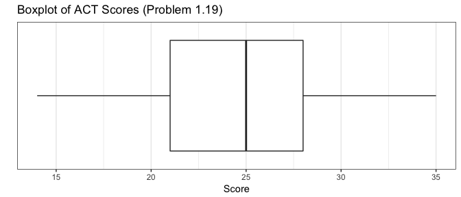

  I don't see any particularly noteworthy features. From what I know about the ACT, this follows a pattern that I would expect. 
  </div></br>
  
  __b)__ Prepare a dot plot of the residuals. What information does this plot provide?
  
  __Solution:__
  <div id="rcorners2">
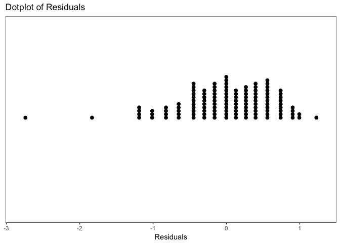
  This dot plot provides information about the distribution of the residuals. We can think of it like a one dimensional scatterplot. These are good for when the sample size is too small for box-plot. 
  </div></br>
  
  __c)__ Plot the residual $e_{i}$ against the fitted values $\hat{Y_{i}}$. What departures from regression model (2.1) can be studied from this plot? What are your findings?
  
  __Solution:__
  <div id="rcorners2">
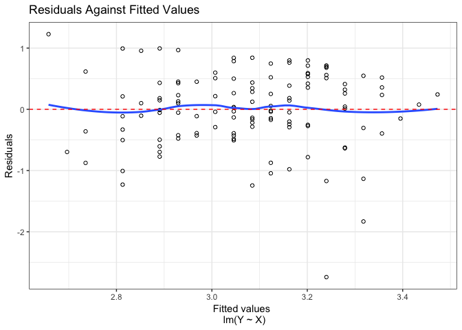
  We can study the residual plot and see that there is a slight curve to the loess regression line through the residuals, it's not an extreme curve so it's not to worrying. We can also see there are some outliers within these data and it's hard to see if the variance is constant just by the plot. 
  </div></br>
  
  __d)__ Prepare a normal probability plot of the residuals. Also obtain the coefficient of correlation between the ordered residuals and their expected values under normality. Test the reasonableness of the normality assumption here using Table B.6 and $\alpha = 0.05$. What do you conclude?
  
  __Solution:__
  <div id="rcorners2">
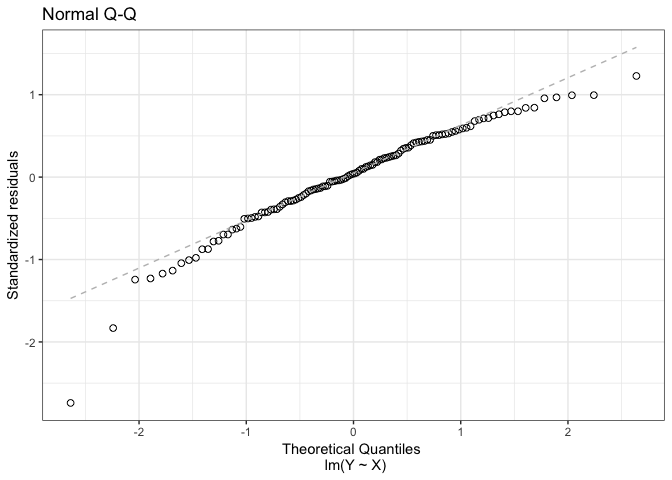

```
## [1] 0.9744497
```

We would wouldnt not accept that these data is normaly distributed in this case. 
  </div></br>
  
  __e)__ Conduct the Brown-Forsythe test to determine whether or not the error variance varies with the level of X. Divide the data into two groups, $X < 26$, $X \geq 26$, and use $\alpha = 0.01$. State the decision rule and conclusion. Does your conclusion support your preliminary findings in part (c)?
  
  __Solution:__
  <div id="rcorners2">

```r
# Brown-Forsythe: Output - F-Statistic & P-value
augment(act.lm) %>% 
  mutate(two.groups = as.factor(case_when(X < 26 ~ "<26", X >= 26 ~ ">=26"))) %>% 
  {lawstat::levene.test(.$.resid, .$two.groups,location = "median")}
```

```
## 
## 	modified robust Brown-Forsythe Levene-type test based on the
## 	absolute deviations from the median
## 
## data:  .$.resid
## Test Statistic = 0.80415, p-value = 0.3717
```

```r
# Hand Coded Brown-Forsythe but results in T-Statistic instead of F-Statistic
# Take the sqrt of the output of the above function and it will give you this
# hand computed stat. 
groups <- augment(act.lm) %>% 
  mutate(two.groups = as.factor(case_when(X < 26 ~ "<26", X >= 26 ~ ">=26")))

d1 <- groups %>% filter(two.groups == "<26") %>% {abs(.$.resid - median(.$.resid))}
d2 <- groups %>% filter(two.groups == ">=26") %>% {abs(.$.resid - median(.$.resid))}

s2 <-  (sum((d1 - mean(d1))^2) + sum((d2 - mean(d2))^2))/(nrow(groups) - 2)
s <- sqrt(s2)

tBF <- (mean(d1) - mean(d2))/(s*sqrt(1/length(d1)+1/length(d2)))
```
  \begin{align*}
  \alpha = 0.01 \\
  \text{For Brown}\text{-Forsythe Test:} \\
  H_{o}: \text{ Error }\text{Variance is Constant } \\
  H_{1}: \text{ Error }\text{Variance is not Constant } \\
  \text{If } |t^{*}_{BF}| \leq t(.995; 118), \text{ conclude } H_{o} \\
  \text{If } |t^{*}_{BF}| > t(.995; 118), \text{ conclude } H_{1}
  \end{align*}
  
  Given the high p-value we fail to reject the null hypothesis and continue to believe that our variance is contant within the model. 
  </div></br>
  
  __f)__ Information is given below for each student on two variables not included in the model, namely, intelligence test score ($X_{2}$) and high school class rank percentile ($X_{3}$). (Note that larger class rank percentiles indicate higher standing in the class, e.g., 1% is near the boom of the class and 99% is near the top of the class.) Plot the residuals against $X_{2}$ and $X_{3}$ on separate graphs to ascertain whether the model can be improved by including either of these variables. What do you conclude?
  
  __Solution:__
  <div id="rcorners2">

```r
p1.19extra <- read.table("http://www.stat.ufl.edu/~rrandles/sta4210/Rclassnotes/data/textdatasets/KutnerData/Chapter%20%203%20Data%20Sets/CH03PR03.txt")
colnames(p1.19extra) <- c("Y","X","X2","X3")

t <- augment(act.lm) %>% 
  mutate(X2 = p1.19extra$X2, X3 = p1.19extra$X3) %>% 
  ggplot(aes(x = X2, y = .resid)) +
  geom_point(shape = 1) + 
  labs(title = "Omitted Variables Plot ~ IQ", x = "IQ", y = "Residuals") +
  theme_bw()

s <- augment(act.lm) %>% 
  mutate(X2 = p1.19extra$X2, X3 = p1.19extra$X3) %>% 
  ggplot(aes(x = X3, y = .resid)) +
  geom_point(shape = 1) + 
  labs(title = "Omitted Variables Plot ~ Class Rank",
       x = "Class Rank", y = "Residuals") +
  theme_bw()

t + s
```

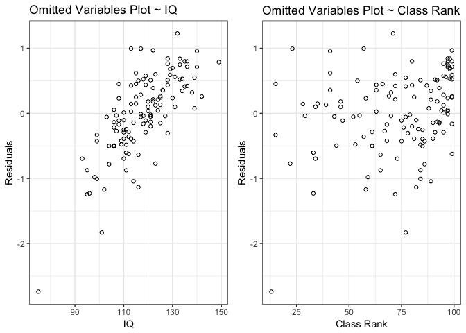

IQ seems to be a strong variable that we could include in the model but Class Rank has no relationship and we should probably leave it out. 
  </div></br>

### 3.4 <span id=recpoints>{6}</span><span id=report>{ 6 / 6 }</span>


```r
# Load the Data:
p1.20 <- read.table("http://www.stat.ufl.edu/~rrandles/sta4210/Rclassnotes/data/textdatasets/KutnerData/Chapter%20%201%20Data%20Sets/CH01PR20.txt")

# Rewrite the column names to be "Y" and "X" to match the textbook:
colnames(p1.20) <- c("Y","X")

copy.lm <- lm(Y ~ X, p1.20)

dotp2 <- augment(copy.lm) %>% 
  ggplot(aes(x = X)) + 
  geom_dotplot(dotsize = .35) + 
  labs(title = "Dotplot of Copiers Serviced", x = "X") +
  ylim(c(-.25,.25)) +
  theme_bw() +
  theme(axis.title.y = element_blank(),
        axis.ticks.y = element_blank(),
        axis.text.y = element_blank(),
        panel.grid.major = element_blank(), 
        panel.grid.minor = element_blank())

timep <- augment(copy.lm) %>% 
  ggplot(aes(x = as.numeric(row.names(.)), y = X)) + 
  geom_point() + 
  geom_line() + 
  labs(title = "Time Plot of Copiers Serviced",
       x = "index") + 
  theme_bw()

dotp.fitted <- augment(copy.lm) %>% 
  ggplot(aes(x = .fitted, y = .resid)) + 
  geom_point(shape = 1) + 
  geom_smooth(se = FALSE, size = 0.5, color = "red") + 
  labs(title = "Errors against Predicted Values", 
       x = "Fitted Values \n lm(Y ~ X)", y = "Residuals") +
  theme_bw()

qq.norm2 <- augment(copy.lm) %>% 
  ggplot(aes(sample = .resid)) + 
  geom_qq(shape = 1, size = 2) + 
  geom_qq_line(color = "red", linetype = 2) +
  labs(title = "Normal Q-Q",
       x = "Theoretical Quantiles \n lm(Y ~ X)", 
       y = "Standardized residuals") +
  theme_bw()

timep.resid <- augment(copy.lm) %>% 
  ggplot(aes(x = as.numeric(row.names(.)), y = .resid)) + 
  geom_point() + 
  geom_line() + 
  labs(title = "Time Plot of Residuals",
       x = "index") + 
  theme_bw()
```

__Refer to Copier Maintenance Problem 1.20__

  __a)__ Prepare a dot plot for the number of copiers serviced $X_{i}$. What information is provided by this plot? Are there any outlying cases with respect to this variable?
  
  __Solution:__
  <div id="rcorners2">
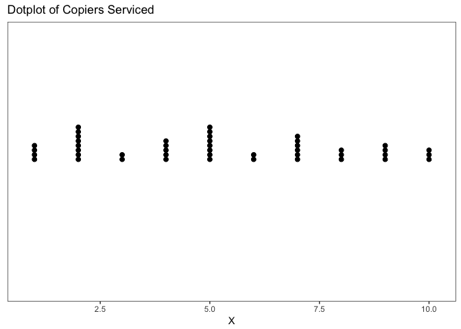
  It does not seem like there are any outlying cases for these data it's seems to be evenly distributed. 
  </div></br>
  
  __b)__ The cases are given in time order. Prepare a time plot for the number of copiers serviced. What does your plot show?
  
  __Solution:__
  <div id="rcorners2">

  It shows that there is a pretty random ammount of copiers serviced in time. Time doesn't seem to have an influence on number of copiers serviced. 
  </div></br>
  
  __c)__ Prepare a stem-and-leaf plot of the residuals. Are there any noteworthy features in this plot?
  
  __Solution:__
  <div id="rcorners2">

```
## 
##   The decimal point is 1 digit(s) to the right of the |
## 
##   -2 | 30
##   -1 | 
##   -1 | 3110
##   -0 | 99997
##   -0 | 44333222111
##    0 | 001123334
##    0 | 5666779
##    1 | 112234
##    1 | 5
```

These data seem relatively normal but a few outliers at the bottom end of 2.3.
  </div></br>
  
  __d)__ Prepare residual plots of $e_{i}$ versus $\hat{Y_{i}}$ and $e_{i}$ versus $X_{i}$ on separate graphs. Do these plots prove the same information? What departures from regression model (2.1) can be studied from these plots? State your findings.
  
  __Solution:__
  <div id="rcorners2">
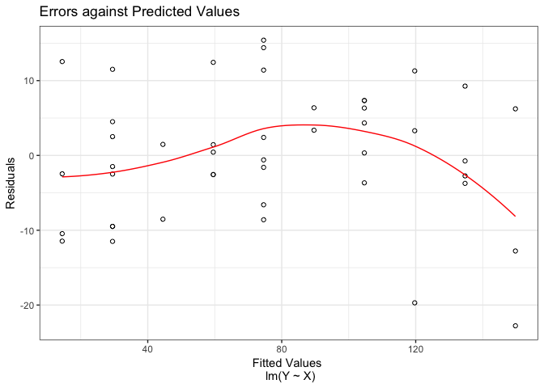

There is a major relationship here that is causing a massive curve in the loess regression line. Some assumptions are obviously being violated here. 
  
  </div></br>
  
  __e)__ Prepare a normal probability plot of the residuals. Also obtain the coefficient of correlation between the ordered residuals and their expected values under normality. Does the normality assumption appear to be tenable here? Use Table B.6 and $\alpha = 0.10.$ What do you conclude?
  
  __Solution:__
  <div id="rcorners2">
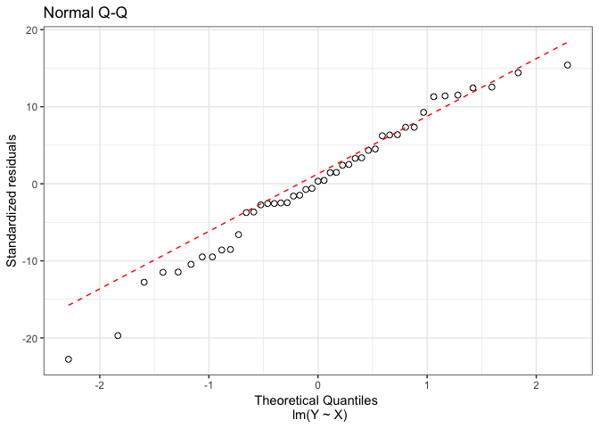

```
## [1] 0.9889098
```
  
The data is normally distributed. 
  </div></br>
  
  __f)__ Prepare a time plot of the residuals of ascertain whether the error terms are correlated over time. What is your conclusion?
  
  __Solution:__
  <div id="rcorners2">
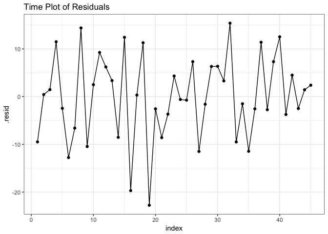
There is randomness in the residuals. 
  </div></br>
  
  __g)__ Assume that (3.10) is applicable and conduct the Breusch-Pagan test to determine whether or not the error variance varies with the level of X. Use $\alpha = 0.05$. State the alternatives, decision rule, and conclusion. 
  
  __Solution:__
  <div id="rcorners2">

```r
bptest(copy.lm, studentize = FALSE)
```

```
## 
## 	Breusch-Pagan test
## 
## data:  copy.lm
## BP = 1.3147, df = 1, p-value = 0.2515
```
Given the high p-value we would fail to reject the null hypothesis and continue to believe these data have constant variance. 
  </div></br>
  
  __h)__ Information is given below on two variables not included in the regression model, namely, mean operational age of copiers serviced on the call ($X_{2}$, in months) and years of experience of the service person making the call ($X_{3}$). Plot the residuals against $X_{2}$ and $X_{3}$ on separate graphs to ascertain whether the model can be improved by including either or both of these variables. What do you conclude?

  __Solution:__
  <div id="rcorners2">

```r
p1.20extra <- read.table("http://www.stat.ufl.edu/~rrandles/sta4210/Rclassnotes/data/textdatasets/KutnerData/Chapter%20%203%20Data%20Sets/CH03PR04.txt")

colnames(p1.20extra) <- c("Y","X","X2","X3")

t <- augment(copy.lm) %>% 
  mutate(X2 = p1.20extra$X2, X3 = p1.20extra$X3) %>% 
  ggplot(aes(x = X2, y = .resid)) +
  geom_point(shape = 1) + 
  labs(title = "Omitted Variables Plot ~ OP Age", x = "Age", y = "Residuals") +
  theme_bw()

s <- augment(copy.lm) %>% 
  mutate(X2 = p1.20extra$X2, X3 = p1.20extra$X3) %>% 
  ggplot(aes(x = X3, y = .resid)) +
  geom_point(shape = 1) + 
  labs(title = "Omitted Variables Plot ~ YoE",
       x = "YoE", y = "Residuals") +
  theme_bw()

t + s
```

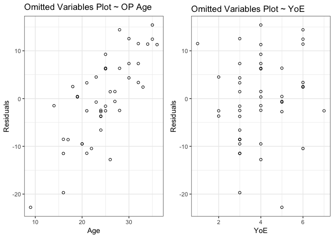<!-- -->
Operations Age looks like it could be a good variable but also Years of Experience could be good as well. 
  </div></br>

### 3.5 <span id=recpoints>{5}</span><span id=report>{ 5 / 5 }</span>


```r
# Load the Data:
p1.21 <- read.table("http://www.stat.ufl.edu/~rrandles/sta4210/Rclassnotes/data/textdatasets/KutnerData/Chapter%20%201%20Data%20Sets/CH01PR21.txt")

# Rewrite the column names to be "Y" and "X" to match the textbook:
colnames(p1.21) <- c("Y","X")

air.lm <- lm(Y ~ X, p1.21)

dotp.x <- augment(air.lm) %>% 
  ggplot(aes(x = X)) + 
  geom_dotplot(dotsize = .35) + 
  labs(title = "Dotplot of Flight Transfers", x = "X") +
  ylim(c(-.25,.25)) +
  theme_bw() +
  theme(axis.title.y = element_blank(),
        axis.ticks.y = element_blank(),
        axis.text.y = element_blank(),
        panel.grid.major = element_blank(), 
        panel.grid.minor = element_blank())

timep.x <- augment(air.lm) %>% 
  ggplot(aes(x = as.numeric(row.names(.)), y = X)) + 
  geom_point() + 
  geom_line() + 
  labs(title = "Time Plot of Transfers",
       x = "index") + 
  theme_bw()

dotp.fitted <- augment(air.lm) %>% 
  ggplot(aes(x = .fitted, y = .resid)) + 
  geom_point(shape = 1) + 
  geom_smooth(se = FALSE, size = 0.5, color = "red") + 
  labs(title = "Errors against Predicted Values", 
       x = "Fitted Values \n lm(Y ~ X)", y = "Residuals") +
  theme_bw()

qq.norm3 <- augment(air.lm) %>% 
  ggplot(aes(sample = .resid)) + 
  geom_qq(shape = 1, size = 2) + 
  geom_qq_line(color = "red", linetype = 2) +
  labs(title = "Normal Q-Q",
       x = "Theoretical Quantiles \n lm(Y ~ X)", 
       y = "Standardized residuals") +
  theme_bw()

timep.resid <- augment(air.lm) %>% 
  ggplot(aes(x = as.numeric(row.names(.)), y = .resid)) + 
  geom_point() + 
  geom_line() + 
  labs(title = "Time Plot of Residuals",
       x = "index") + 
  theme_bw()
```

__Refer to Airfreight Breakage Problem 1.21__

  __a)__ Prepare a dot plot for the number of transfers $X_{i}$. Does the distribution of number of transfers appear to be asymmetrical?
  
  __Solution:__
  <div id="rcorners2">
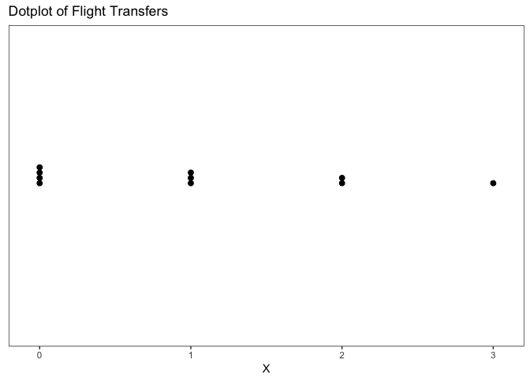
Yes, these data appear to be asymmetrical with most of the transfers being around zero. 
  </div></br>
  
  __b)__ The cases are given in time order. Prepare a time plot for the number of transfers. Is any systematic pattern evident in your plot? Discuss. 
  
  __Solution:__
  <div id="rcorners2">
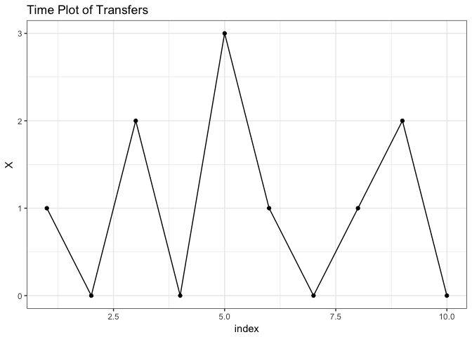
It seems there could be some systematic patterns within these data as they go up high and back to zero almost each time. 
  </div></br>
  
  __c)__ Obtain the residuals $e_{i}$ and prepare a steam-and-leaf plot of the residuals. What information is provided by your plot?
  
  __Solution:__
  <div id="rcorners2">

```
## 
##   The decimal point is at the |
## 
##   -2 | 2
##   -1 | 222
##   -0 | 2
##    0 | 888
##    1 | 88
```
It shows the distribtution of the residuals. 
  </div></br>
  
  __d)__ Plot the residuals $e_i$ against $X_i$ to ascertain whether any departures from regression model (2.1) are evident. What is your conclusion?
  
  __Solution:__
  <div id="rcorners2">
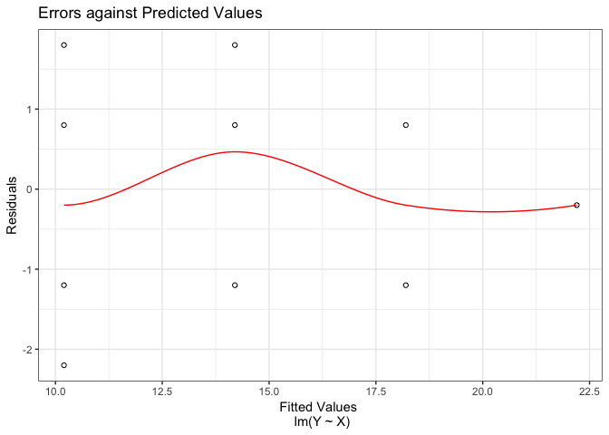

There is extreme curvature in the residuals and the variance does not seem constant. 
  </div></br>
  
  __e)__ Prepare a normal probability plot of the residuals. Also obtain the coefficient of correlation between the ordered residuals and their expected values under normality. Does the normality assumption appear to be tenable here? Use Table B.6 and $\alpha = 0.10.$ What do you conclude?
  
  __Solution:__
  <div id="rcorners2">
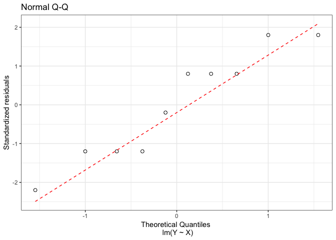

```
## [1] 0.9609751
```
Using the table B.6 we can see that we are above the level at which we would reject if our data is normal. We will continue to assume these data to be normally distributed. 
  </div></br>
  
  __f)__ Prepare a time plot of the residuals. What information is provided by your plot?
  
  __Solution:__
  <div id="rcorners2">
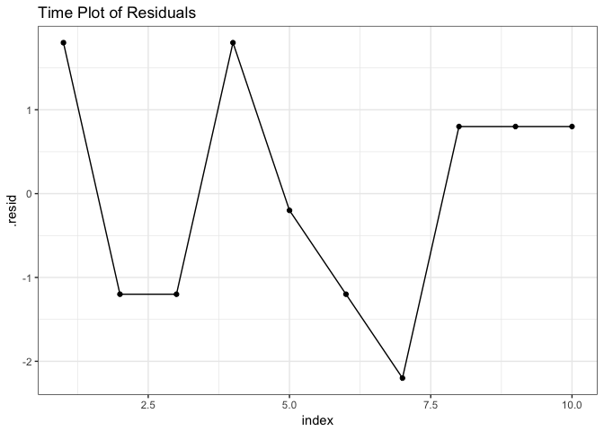
There is a pattern in the residuals so they do not seem to be independent of each other. 
  </div></br>
  
  __g)__ Assume that (3.10) is applicable and conduct the Breusch-Pagan test to determine whether or not the error variance varies with the level of X. Use $\alpha = 0.10$. State the alternatives, decision rule, and conclusion. Does your conclusion support your preliminary findings in part (d)?
  
  __Solution:__
  <div id="rcorners2">

```
## 
## 	studentized Breusch-Pagan test
## 
## data:  air.lm
## BP = 3.0628, df = 1, p-value = 0.0801
```
\begin{align*}
\alpha = 0.10 \\
\text{For Breusch-Pagan Test:} \\
H_{o}: \gamma_{1} = 0 \\
H_{1}: \gamma_{1} \neq  0 \\
\text{If } X^{2}_{BP} \leq \chi^{2}(.95;1) \text{ then conclude } H_{o} \\
\text{If } X^{2}_{BP} > \chi^{2}(.95;1) \text{ then conclude } H_{a}
\end{align*}

Given our p-value and alpha level of 0.10 we fail to reject the null and will continue to believe the residuals have constant variance. 
  </div></br>
  
### 3.6 <span id=points>{5}</span><span id=report>{ 5 / 5 }</span>


```r
# Load the Data:
p1.22 <- read.table("http://www.stat.ufl.edu/~rrandles/sta4210/Rclassnotes/data/textdatasets/KutnerData/Chapter%20%201%20Data%20Sets/CH01PR22.txt")

# Rewrite the column names to be "Y" and "X" to match the textbook:
colnames(p1.22) <- c("Y","X")

hard.lm <- lm(Y ~ X, p1.22)

boxp <- augment(hard.lm) %>% 
  ggplot(aes(x = factor(0), y = X)) +
  geom_boxplot() + scale_x_discrete(breaks = NULL) +
  coord_flip() +
  labs(title = "Boxplot of Residuals", x = "", y = "Residuals") +
  theme_bw()

fitted.plot <- augment(hard.lm) %>% 
  ggplot(aes(x = .fitted, y = .resid)) +
  geom_point(shape = 1) + 
  geom_smooth(method = "loess", se = FALSE, color = "red", size = .5) +
  labs(title = "Residuals against Fitted Values",
       x = "Fitted Values \n lm(Y ~ X)", y = "Residuals") + 
  theme_bw()

qq.norm <- augment(hard.lm) %>% 
  ggplot(aes(sample = .resid)) + 
  geom_qq(shape = 1, size = 2) + 
  geom_qq_line(color = "red", linetype = 2) +
  labs(title = "Normal Q-Q",
       x = "Theoretical Quantiles \n lm(Y ~ X)", 
       y = "Standardized residuals") +
  theme_bw()
```

__Refer to Plastic Harndess Problem 1.22__

  __a)__ Obtain the reisiduals $e_{i}$ and prepare a box plot of the residuals. What information is provided by your plot?
  
  __Solution:__
  <div id="rcorners3">
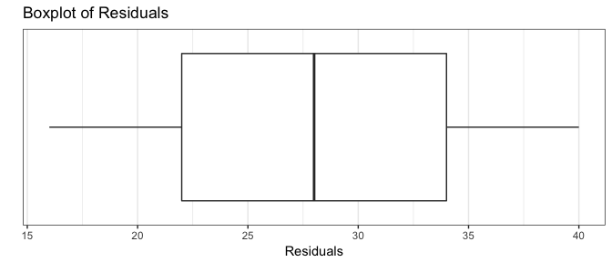
The residuals appear to be relatively symmetric. 
  
  </div></br>
  
  __b)__ Plot the residuals $e_{i}$ against the fitted values $\hat{Y_{i}}$ to ascertain whether any departures from ression model (2.1) are evident. State your findings.
  
  __Solution:__
  <div id="rcorners3">
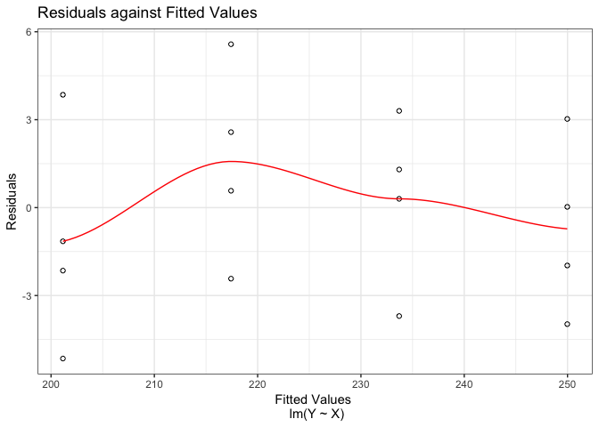
  It appears to be that theses data don't have constant variance or a linear relationship. 
  </div></br>
  
  __c)__ Prepare a normal probability plot of the residuals. Also obtain the coefficient of correlation between the ordered residuals and their expected values under normality. Does the normality assumption appear to be resonable here? Use Table B.6 and $\alpha = 0.05.$ What do you conclude?
  
  __Solution:__
  <div id="rcorners3">


```
## [1] 0.9905063
```
  The data appears to be normal. 
  </div></br>
  
  __d)__ Compare the frequencies of the residuals against the expected frequences under normality using the 25th, 50th, and 75th percentiles of the relevant t distribtuion. Is the information provided by these comparisons consistent with the findings from the normal probability plot in part (c)?
  
  __Solution:__
  <div id="rcorners3">
  <center>

```r
pander::pander(
  tibble(
    order.resid = sort(hard.lm$residuals), 
    exp.value = glance(hard.lm)$sigma*qnorm((1:16-.375)/(16+.25))
    )
  )
```


-------------------------
 order.resid   exp.value 
------------- -----------
    -5.15        -5.72   

   -3.975       -4.145   

    -3.7        -3.196   

   -2.425       -2.464   

    -2.15       -1.841   

   -1.975        -1.28   

    -1.15       -0.7551  

    0.025       -0.2497  

     0.3        0.2497   

    0.575       0.7551   

     1.3         1.28    

    2.575        1.841   

    3.025        2.464   

     3.3         3.196   

    3.85         4.145   

    5.575        5.72    
-------------------------

```r
qt(.25,14); qt(.5,14); qt(.75,14)
```

```
## [1] -0.6924171
```

```
## [1] 0
```

```
## [1] 0.6924171
```
  </center>
  It seems likely that the data is normal because it follows relatively close to the expected value of normal data. 
  </div></br>
  
  __e)__ Use the Brown-Forsythe test to determine whether or not the error variance varies with the level of X. Divide the data into two groups, $X \leq 24$, $X > 24$, and use $\alpha = 0.05$. State the decision rule and conclusion. Does your conclusion support your preliminary findings in part (b)?
  
  __Solution:__
  <div id="rcorners3">

```r
augment(hard.lm) %>% 
  mutate(two.groups = as.factor(case_when(X <= 24 ~ "<=24", X > 24 ~ ">24"))) %>% 
  {lawstat::levene.test(.$.resid, .$two.groups,location = "median")}
```

```
## 
## 	modified robust Brown-Forsythe Levene-type test based on the
## 	absolute deviations from the median
## 
## data:  .$.resid
## Test Statistic = 0.73237, p-value = 0.4065
```
Given the p-value we can continue under the belief that the residuals have constant variance. 
  </div></br>

### 3.7 <span id=points>{4}</span><span id=report>{ 4 / 4 }</span>


```r
# Load the Data:
p1.27 <- read.table("http://www.stat.ufl.edu/~rrandles/sta4210/Rclassnotes/data/textdatasets/KutnerData/Chapter%20%201%20Data%20Sets/CH01PR27.txt")

# Rewrite the column names to be "Y" and "X" to match the textbook:
colnames(p1.27) <- c("Y","X")

mass.lm <- lm(Y ~ X, p1.27)

dotp <- augment(mass.lm) %>% 
  ggplot(aes(x = .resid)) +
  geom_dotplot(dotsize = .50) + 
  labs(title = "Dotplot of Residuals", x = "Residuals") +
  ylim(c(-.25,.25)) +
  theme_bw() +
  theme(axis.title.y = element_blank(),
        axis.ticks.y = element_blank(),
        axis.text.y = element_blank(),
        panel.grid.major = element_blank(), 
        panel.grid.minor = element_blank())

fitted.plot <- augment(mass.lm) %>% 
  ggplot(aes(x = .fitted, y = .resid)) +
  geom_point(shape = 1) + 
  geom_smooth(method = "loess", se = FALSE, color = "red", size = .5) + 
  labs(title = "Residuals Against Fitted Values Plot",
       x = "Fitted Values \n lm(Y ~ X)", y = "Residuals") + 
  theme_bw()

xi.plot <- augment(mass.lm) %>% 
  ggplot(aes(x = X, y = .resid)) +
  geom_point(shape = 1) + 
  geom_smooth(method = "loess", se = FALSE, color = "blue", size = .5) +
  labs(title = "Residuals Against Xi Values Plot",
       x = "X", y = "Residuals") +
  theme_bw()

qq.norm <- augment(mass.lm) %>% 
  ggplot(aes(sample = .resid)) + 
  geom_qq(shape = 1, size = 2) + 
  geom_qq_line(color = "grey", linetype = 2) +
  labs(title = "Normal Q-Q",
       x = "Theoretical Quantiles \n lm(Y ~ X)", 
       y = "Standardized residuals") +
  theme_bw()
```

__Refer to Muscle Mass Problem 1.27__

  __a)__ Prepare a stem-and-leaf plot for the ages $X_{i}$. Is this plot consistent with the random selection of women from each 10-year age group? Explain.
  
  __Solution:__
  <div id="rcorners3">

```r
stem(mass.lm$residuals)
```

```
## 
##   The decimal point is 1 digit(s) to the right of the |
## 
##   -1 | 6
##   -1 | 431000
##   -0 | 9988887766555
##   -0 | 4433222111100
##    0 | 112333344
##    0 | 55777888899
##    1 | 011134
##    1 | 
##    2 | 3
```
  Similar to the below
  </div></br>
  
  __b)__ Obtain the residuals $e_{i}$ and prepare a dot plot of the residuals. What does your plot show?
  
  __Solution:__
  <div id="rcorners3">
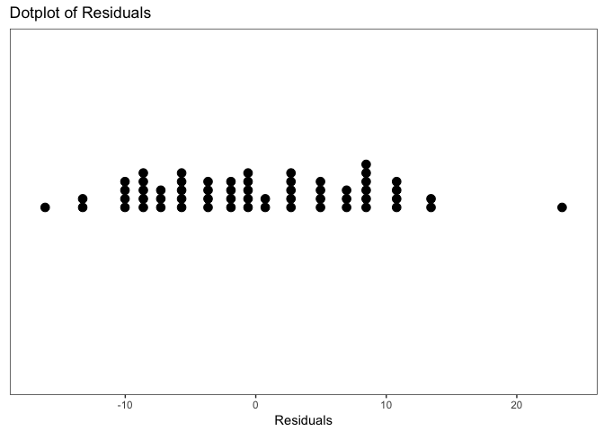
  It shows that the residuals are pretty well distributed but there is one outlier that looks a little extreme. 
  </div></br>
  
  __c)__ Plot the residuals $e_{i}$ against $\hat{Y_{i}}$ and also against $X_{i}$ on separate graphs to ascertain whether any departures from regression model (2.1) are evident. Do the two plots provide the same provide the same information? State your conclusions. 
  
  __Solution:__
  <div id="rcorners3">
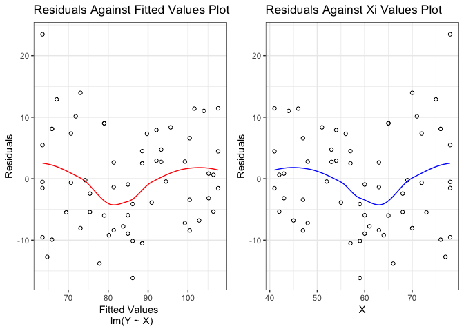
  The plots provide similar information it looks like there is some serious curvature in the relationship of the X values and the fitted values. Our assumptions are seriously called into question here. 
  </div></br>
  
  __d)__ Prepare a normal probability plot of the residuals. Also obtain the coefficient of correlation between the ordered resiuals and their expected values under normality to ascertain whether the normality assumption is tenablehere. Use Table B.6 and $\alpha = .10$. What do you conclude?
  
  __Solution:__
  <div id="rcorners3">
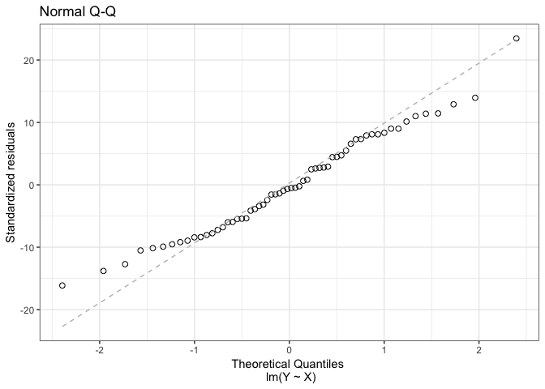

```
## [1] 0.9896158
```
Looking at the table and our correlation coefficient we can move forward knowing our data is approximatley normally distributed. 
  </div></br>
  
  __e)__ Assume that (3.10) is applicable and conduct the Breusch-Pagan test to determine whether or not the error variance varies with the level of X. Use $\alpha = 0.01$. Stat the alternatives, decision rule, and conlusion. Is your conclusion consistent with your preliminary findings in part (c)?
  
  __Solution:__
  <div id="rcorners3">

```r
bptest(mass.lm)
```

```
## 
## 	studentized Breusch-Pagan test
## 
## data:  mass.lm
## BP = 4.4221, df = 1, p-value = 0.03548
```
Given our p-value we fail to reject the null and will continue to believe that the residuals have constant variance.
  </div></br>
  
### 3.8 <span id=points>{3}</span><span id=report>{ 3 / 3 }</span>


```r
# Load the Data:
p1.28 <- read.table("http://www.stat.ufl.edu/~rrandles/sta4210/Rclassnotes/data/textdatasets/KutnerData/Chapter%20%201%20Data%20Sets/CH01PR28.txt")

# Rewrite the column names to be "Y" and "X" to match the textbook:
colnames(p1.28) <- c("Y","X")

crime.lm <- lm(Y ~ X, p1.28)

boxp <- augment(crime.lm) %>% 
  ggplot(aes(x = factor(0), y = X)) + 
  geom_boxplot() + scale_x_discrete(breaks = NULL) +
  coord_flip() + 
  labs(title = "Boxplot of Residuals", x = "", y = "Residuals") +
  theme_bw()

fitted.plot <- augment(crime.lm) %>% 
  ggplot(aes(x = .fitted, y = .resid)) +
  geom_point(shape = 1) +
  geom_smooth(method = "loess", se = FALSE, color = "blue", size = .5) +
  labs(title = "Fitted Values vs Residuals", x = "Fitted Values \n lm(Y~X)",
       y = "Residuals") +
  theme_bw()

qq.norm <- augment(crime.lm) %>% 
  ggplot(aes(sample = .resid)) + 
  geom_qq(shape = 1, size = 2) + 
  geom_qq_line(color = "grey", linetype = 2) +
  labs(title = "Normal Q-Q",
       x = "Theoretical Quantiles \n lm(Y ~ X)", 
       y = "Standardized residuals") +
  theme_bw()
```

__Refer to Crime Rate Problem 1.28__

  __a)__ Prepare a stem-and-leaf plot for the percentage of individuals in the county having at least a high school diploma $X_{i}$. What information does your plot provide?
  
  __Solution:__
  <div id="rcorners3">

```r
stem(p1.28$X)
```

```
## 
##   The decimal point is 1 digit(s) to the right of the |
## 
##   6 | 1444
##   6 | 5678
##   7 | 00334444
##   7 | 5555666677777778888888999999
##   8 | 000011111112222222233333344444
##   8 | 55578889
##   9 | 11
```
  We can see the distribution of the $X_{i}$ within the data set. 
  </div></br>
  
  __b)__ Obtain the residuals $e_{i}$ and prepare a box plot of the residuals. Does the distribution of the residuals appear to be symmetrical?
  
  __Solution:__
  <div id="rcorners3">
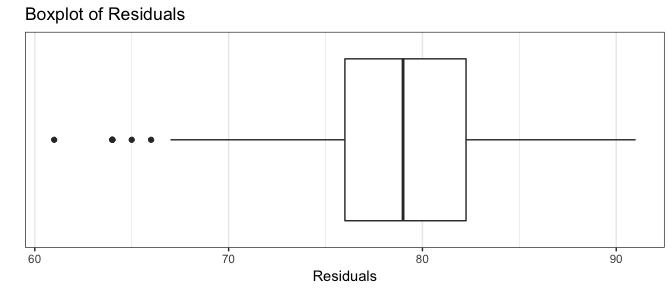
  Given the outliers showing in the boxplot it does not seem the residuals are symmetrical. 
  </div></br>
  
  __c)__ Make a residual plot of $e_{i}$ versus $\hat{Y_{i}}$. What does the plot show?
  
  __Solution:__
  <div id="rcorners3">
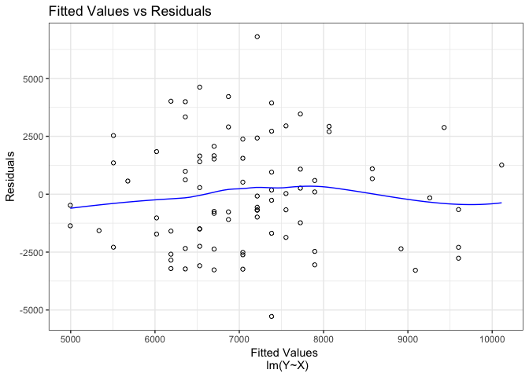
  There is some slight curvature in our loess regression line that can be a little worrying but it's not too extreme. It remains relatively flat throughout the dataset. 
  </div></br>
  
  __d)__ Prepare a normal probability plot of the residuals. Also obtain the coefficient of correlation between the ordered residuals and their expected values under nomrality. Test the reasonableness of the normality assuption using Table B.6 and $\alpha = 0.05$. What do you conclude?
  
  __Solution:__
  <div id="rcorners3">
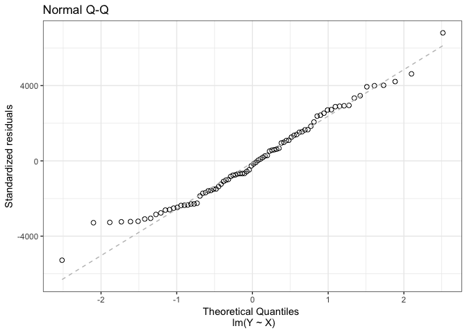

```
## [1] 0.988603
```
  We can believe that our data is approx. normally distributed. 
  </div></br>
  
  __e)__ Conduct the Brown-Forsythe test to determine whether or not the error variance varies with the level of $X$. Divide the data into the two groups, $X \leq 69$, $X > 69$, and use $\alpha = 0.05$. State the decision rule and conclusion. Does your conclusion support your preliminary findings in part (c)?
  
  __Solution:__
  <div id="rcorners3">

```r
augment(crime.lm) %>% 
  mutate(two.groups = as.factor(case_when(X <= 69 ~ "<=69", X > 69 ~ ">69"))) %>% 
  {lawstat::levene.test(.$.resid, .$two.groups,location = "median")}
```

```
## 
## 	modified robust Brown-Forsythe Levene-type test based on the
## 	absolute deviations from the median
## 
## data:  .$.resid
## Test Statistic = 0.12604, p-value = 0.7235
```
 Our residuals have constant variance. 
  </div></br>

### 3.13 <span id=recpoints>{3}</span><span id=report>{ 3 / 3 }</span>


```r
# Load the Data:
p1.20 <- read.table("http://www.stat.ufl.edu/~rrandles/sta4210/Rclassnotes/data/textdatasets/KutnerData/Chapter%20%201%20Data%20Sets/CH01PR20.txt")

# Rewrite the column names to be "Y" and "X" to match the textbook:
colnames(p1.20) <- c("Y","X")

copy.lm <- lm(Y ~ X, p1.20)

lof <- pureErrorAnova(copy.lm)
```

__Refer to Copier Maintenance Problem 1.20__

  __a)__ What are the alternative conclusions when testing for lack of fit of a linear regression function?
  
  __Solution:__
  <div id="rcorners2">
  $$
  H_o: E \big\{ Y \big\} = \beta_0 + \beta_1X \\
  H_a: E \big\{ Y \big\} \ne \beta_0 + \beta_1X
  $$
  </div></br>
  
  __b)__ Perform the test indicated in part (a). Control the risk of Type I error at 0.05. State the decision rule and conclusion.
  
  __Solution:__
  <div id="rcorners2">

```r
lof
```

```
## Analysis of Variance Table
## 
## Response: Y
##              Df Sum Sq Mean Sq  F value Pr(>F)    
## X             1  76960   76960 962.8105 <2e-16 ***
## Residuals    43   3416      79                    
##  Lack of fit  8    619      77   0.9676 0.4766    
##  Pure Error  35   2798      80                    
## ---
## Signif. codes:  0 '***' 0.001 '**' 0.01 '*' 0.05 '.' 0.1 ' ' 1
```

The decision rule is:

  If $|F^*_{BF}| \le$ F(95), conclude the error variance is constant
  
  If $|F^*_{BF}| \gt$ F(95), conclude the error variance is not constant
  
  </div></br>
  
  __c)__ Does the test in part (b) detect other departures from regression model (2.1), such as lack of constant variance or lack of normality in the error terms? Could the results of the test of lack of fit be affected by such departures? Discuss. 
  
  __Solution:__
  <div id="rcorners2">
  Nope due to the high pvalue there are no departures so the model is valid. 
  </div></br>

</div>


 <style>
#points {
  font-size:.8em;
  padding-left:5px;
  font-weight:bold; 
  color:#317eac;
}

#recpoints {
  font-size:.8em;
  padding-left:5px;
  font-weight:bold; 
  color:#7eac31;
}

#report {
  font-size:.7em;
  padding-left:15px;
  font-weight:normal; 
  color:#5a5a5a;
}

#datalink {
  font-size:.5em;
  color:#317eac;
  padding-left:5px;
}

#headnote {
  font-size:.6em;
  color:#787878;
}

#note {
  font-size:.8em;
  color:#787878;
}

#headpoints {
 font-size:12pt;
 color: #585858; 
 padding-left: 15px;
}

#rcorners2 {
    border-radius: 25px;
    border: 2px solid #73AD21;
    padding: 20px; 
    width: auto;
    height: auto;    
}

#rcorners3 {
    border-radius: 25px;
    border: 2px solid #317eac;
    padding: 20px; 
    width: auto;
    height: auto;    
}
</style>


<footer>
</footer>


 

 

 

 
